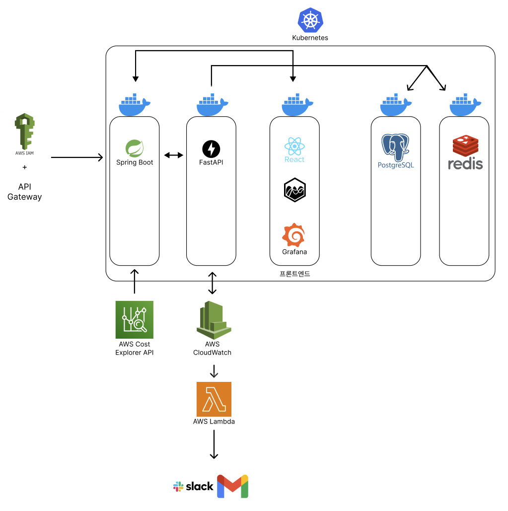

# 조선대학교 산학프로젝트1 02분반 11
# ☁️ 클라우드 비용 최적화 솔루션 개발

---

## 👥 담당 역할

| 이름     | 역할 |
|----------|------|
| **김기욱** | 팀장, 전체 기획 및 일정 관리, 백엔드(Spring Boot) 개발, 프론트 구조 설계, 발표 |
| **김준서** | 분석 서버(FastAPI) 개발, DB 연동, 절감 로직 구현 |
| **정욱**   | 회의록 정리, 계획서/PPT 작성 보조, 문서 관리 |
| **나승빈** | 프론트엔드 보조 (React 컴포넌트 UI 설계), 발표자료 시각 보조 |
| **이승현** | 비용 절감/경쟁 사례 리서치, 테스트 피드백, 발표 리허설 참여 |

---

## 📌 아이디어 개요

클라우드를 사용하는 프리랜서 개발자, 소규모 스타트업, 산학 협력 기업들이  
**복잡한 비용 구조**와 **비효율적인 리소스 운영**으로 어려움을 겪고 있습니다.

본 프로젝트는 다음 기능을 갖춘 **클라우드 비용 분석 및 자동 최적화 도구**를 개발합니다:

- AWS 비용 데이터 자동 수집
- 유휴 리소스 탐지 (사용률 < 20%)
- 절감 시뮬레이션 및 추천
- 대시보드 시각화
- 예산 초과 시 Slack/Email 알림

---

## 🛠️ 기술 스택

| 분야 | 기술 | 설명 |
|------|------|------|
|   | **Backend** | API Gateway, 비용 수집 스케줄링 |
|   | **분석 로직** | 유휴 리소스 탐지, 절감 시뮬레이션 |
|   | **DB** | 비용 데이터 저장, 캐싱 |
|   | **Frontend** | 대시보드 UI 및 시각화 |
|   | **DevOps** | 컨테이너화 및 CI/CD 자동화 |
|   | **클라우드 연동** | 비용 API, Lambda 알림, Email/Slack 전송 |

---

## 🔁 시스템 아키텍처

> **AWS 비용 수집 → Spring Boot API 게이트웨이 → FastAPI 분석 컨테이너 → PostgreSQL 저장 & Redis 캐시 → React 대시보드 시각화 → AWS Lambda + Slack/Email 알림**

---

## ✅ 클라우드 비용 최적화 시스템 - 전체 작동 흐름 요약

---

### 🧾 1. 사용자 인증 및 접근 흐름
- 사용자는 AWS IAM 연동을 통해 인증된 사용자로 등록됨.
- 인증이 완료되면 해당 사용자의 리소스 접근 권한을 획득 (Access Key 기반, 향후 OIDC도 고려).

---

### 🌐 2. API Gateway → Backend 흐름
- Spring Boot 컨테이너는 API Gateway 역할을 하며 모든 외부 요청을 수신.
- 인증, 라우팅, 요청 관리의 중심 허브 역할 수행.

---

### 💰 3. 비용 수집 (AWS Cost Explorer API)
- Spring Boot에서 주기적으로 AWS Cost Explorer API 호출.
- 서비스별 월간/일간 비용 데이터를 수집하여 FastAPI로 전송.

---

### 📊 4. 리소스 상태 분석 (FastAPI)
- 전달받은 데이터 기반으로:
    - 유휴 리소스 탐지 (CPU 사용률 등)
    - 절감 시뮬레이션 수행 (다운사이징, 정지 등)
- 분석 결과는 PostgreSQL에 저장, 일부는 Redis에 캐싱.

---

### 🛑 5. 실시간 모니터링 및 임계값 대응
- AWS CloudWatch에서 특정 임계값 조건 모니터링.
- 조건 만족 시 AWS Lambda가 Trigger.
- Lambda는 알림 요청을 Slack/Gmail 등으로 전달.

---

### 📈 6. 사용자 대시보드 (React + Grafana)
- 사용자는 React 기반 대시보드에서 분석 결과 및 비용 현황을 실시간으로 확인.
- 주요 시각화:
    - 비용 추이 그래프
    - 유휴 리소스 테이블
    - 절감 시뮬레이션 카드 UI
    - Grafana 기반 관리자 모니터링 보드

---

### 🔧 7. 인프라 구성 및 배포
- 모든 서비스는 Docker로 컨테이너화.
- Kubernetes를 통해 컨테이너 오케스트레이션.
- CI/CD는 GitHub Actions를 통해 브랜치 머지 시 자동 배포.
- IaC 관리를 위한 Terraform/Ansible은 추후 적용 예정.
